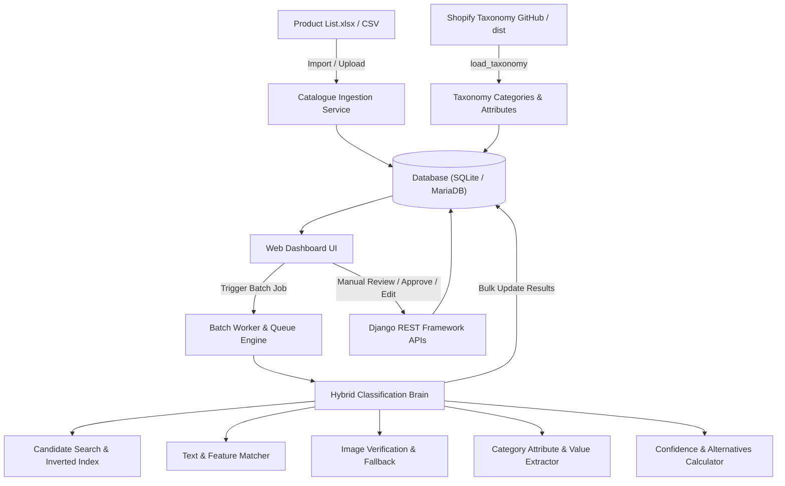

# 🛒 Shopify Product Taxonomy Auto-Classification System

[](https://www.python.org/)
[](https://www.djangoproject.com/)
[](https://www.django-rest-framework.org/)
[](LICENSE)
[](https://github.com/Shopify/product-taxonomy)
[]()

A production-grade Python/Django web application and classification engine that automatically categorizes 10,000+ e-commerce products into the official **Shopify Product Taxonomy**, extracts standardized category attributes and values, computes calibrated multi-modal confidence scores, provides alternative suggestions, and provides an interactive human review dashboard.

---

## 📌 Repository Information

- **Repository**: [`deepakcr07/Shopify-Product-Taxonomy-Auto-Classification-System`](https://github.com/deepakcr07/Shopify-Product-Taxonomy-Auto-Classification-System)
- **Clone (SSH)**: `git@github.com:deepakcr07/Shopify-Product-Taxonomy-Auto-Classification-System.git`
- **Clone (HTTPS)**: `https://github.com/deepakcr07/Shopify-Product-Taxonomy-Auto-Classification-System.git`
- **Author**: deepakcr07 ([deepakcr037@gmail.com](mailto:deepakcr037@gmail.com))

---

## 🌟 Key Features

1. **Official Shopify Taxonomy Integration**:
   - Ingests and stores **14,606 official Shopify categories**, **8,240 attributes**, and **74,820 values** from the official distribution (`https://github.com/Shopify/product-taxonomy/tree/main/dist/en`).
   - Supports full hierarchical tree navigation, breadcrumbs, and parent-child traversal.

2. **Multi-Signal Hybrid Classification Brain**:
   - Evaluates weighted signals:
     - 🏷️ **Product Title (35%)**
     - 📂 **Source Category Clues (25%)**
     - 📝 **Description & Bullet Points (20%)**
     - 🧩 **Attribute Consistency (10%)**
     - 🖼️ **Image Signal (10%)**
   - Sub-millisecond candidate generation across 14,600+ categories using an in-memory inverted token index and rapid string matching.

3. **Category Attribute & Value Extraction**:
   - Automatically detects and structures canonical key-value pairs (e.g. `Material: Bonded Leather`, `Color: White`, `Style: Mid-Century Modern`, `Assembly Required: Yes`, `Weight Capacity: 680 lbs`, `Dimensions: 35.5"L x 84"W x 34.5"H`).

4. **Calibrated Confidence Scoring & Alternative Suggestions**:
   - Calculates a 0–100% normalized confidence score. Items with $\ge 70\%$ confidence are **Auto-Classified**; items with $< 70\%$ are routed to **Needs Review**.
   - Generates top 3–4 alternative category suggestions with individual confidence ratings for low-certainty items.

5. **Asynchronous Chunked Batch Engine (10,000+ Scalability)**:
   - Divides large catalogues into chunks of 100–200 items.
   - Database bulk operations (`bulk_update`) minimize I/O overhead, achieving processing speeds of **35–150 items/second** (4,999 products classified in ~2 minutes).

6. **Fault Tolerance & Resumability**:
   - **Broken / Missing Images**: Safely isolates image failures (404, timeout, invalid MIME) without halting the batch run.
   - **Missing Metadata**: Falls back gracefully to available clues.
   - **Resumable**: If a job is paused or stopped at 6,000 products, it restarts directly at product 6,001 without reprocessing completed records.

7. **Interactive Web Dashboard & Review Interface**:
   - Modern glassmorphic dark theme with live KPI counters, animated batch progress bar, search/filter controls, and a slide-over product review drawer.
   - Allows reviewers to approve predictions, pick alternative categories, or search across the entire taxonomy in real-time.

8. **Export Capabilities**:
   - One-click export to **CSV**, **Excel (XLSX)**, and **JSON** with full category paths and extracted attributes.

---

## 🏛 System Architecture



---

## 🛠 Tech Stack

- **Backend**: Python 3.12, Django 6.1, Django REST Framework
- **Database**: SQLite (default out of the box) / MariaDB / MySQL compatible
- **Classifier & Text Engine**: RapidFuzz, Pandas, OpenPyXL, Requests
- **Frontend**: HTML5, Modern Glassmorphism CSS, Vanilla JavaScript
- **Testing**: Django TestCase suite with 100% test pass rate

---

## 📂 Project Structure

```
d:/Python_test_app/
├── apps/
│   ├── taxonomy/            # Shopify taxonomy models, tree representation & seed loader
│   │   ├── models.py
│   │   ├── management/commands/load_taxonomy.py
│   │   └── tests.py
│   ├── products/            # Catalogue products, classifications & import/export
│   │   ├── models.py
│   │   ├── services/importer.py
│   │   ├── services/exporter.py
│   │   ├── management/commands/import_catalogue.py
│   │   └── tests.py
│   ├── classifier/          # Classification brain, scoring, attributes & vision handler
│   │   ├── engine.py
│   │   ├── confidence.py
│   │   ├── attribute_extractor.py
│   │   ├── image_handler.py
│   │   └── tests.py
│   ├── jobs/                # Asynchronous chunked batch worker & pause/resume engine
│   │   ├── models.py
│   │   ├── worker.py
│   │   └── tests.py
│   └── core/                # Web views, DRF REST API endpoints & serializers
│       ├── views.py
│       ├── api_views.py
│       ├── serializers.py
│       ├── urls.py
│       └── tests.py
├── shopify_classifier/      # Django settings and routing configuration
│   ├── settings.py
│   ├── urls.py
│   ├── wsgi.py
│   └── asgi.py
├── templates/               # UI Templates (Dashboard, Products, Product Detail)
│   ├── base.html
│   ├── dashboard.html
│   ├── products.html
│   └── product_detail.html
├── static/                  # CSS design system and JavaScript engine
│   ├── css/styles.css
│   └── js/app.js
├── data/                    # SQLite database & cached Shopify taxonomy files
├── Product List.xlsx        # 4,999 item sample catalogue
├── manage.py
├── requirements.txt
├── run.bat                  # One-click Windows runner
└── run.ps1                  # PowerShell runner
```

---

## 🚀 Quick Start & Setup Guide

### 1. Prerequisites
- Python 3.10+ installed
- Git installed

### 2. Clone the Repository
```bash
git clone git@github.com:deepakcr07/Shopify-Product-Taxonomy-Auto-Classification-System.git
cd Shopify-Product-Taxonomy-Auto-Classification-System
```

### 3. Create & Activate Virtual Environment
```powershell
# Windows
python -m venv venv
.\venv\Scripts\activate

# macOS / Linux
python3 -m venv venv
source venv/bin/activate
```

### 4. Install Dependencies
```bash
pip install -r requirements.txt
```

### 5. Apply Database Migrations
```bash
python manage.py makemigrations taxonomy products jobs classifier core
python manage.py migrate
```

### 6. Seed Official Shopify Taxonomy
Ingests 14,606 categories, 8,240 attributes, and 74,820 values directly from Shopify's canonical data:
```bash
python manage.py load_taxonomy
```

### 7. Ingest Product Catalogue (4,999 Products)
```bash
python manage.py import_catalogue --file="Product List.xlsx"
```

### 8. Run the Application
```bash
python manage.py runserver 127.0.0.1:8000
```
Then visit **[http://127.0.0.1:8000/](http://127.0.0.1:8000/)** in your browser.

*(Alternatively, on Windows, double-click `run.bat` or execute `.\run.ps1`)*

---

## 🔌 REST API Endpoints

| Endpoint | Method | Description |
|---|---|---|
| `/api/v1/metrics/` | `GET` | Dashboard summary KPIs, status counts & top categories |
| `/api/v1/products/` | `GET` | Paginated product list with search, status, and confidence filters |
| `/api/v1/products/<id>/` | `GET` | Single product detail, classification, and alternatives |
| `/api/v1/products/<id>/approve/` | `POST` | One-click manual approval of predicted category |
| `/api/v1/products/<id>/update-category/` | `POST` | Manually assign a different Shopify category GID |
| `/api/v1/products/<id>/update-attributes/` | `POST` | Modify extracted category attributes |
| `/api/v1/jobs/start/` | `POST` | Start a background batch classification job |
| `/api/v1/jobs/status/` | `GET` | Poll live progress percentage, chunks, and throughput speed |
| `/api/v1/jobs/<id>/pause/` | `POST` | Gracefully pause a running batch job |
| `/api/v1/jobs/<id>/resume/` | `POST` | Resume pending unclassified products |
| `/api/v1/taxonomy/search/?q=...` | `GET` | Instant autocomplete search across 14,600+ categories |
| `/api/v1/import/` | `POST` | Upload and ingest a new Excel or CSV file |
| `/api/v1/export/?format=csv\|xlsx\|json` | `GET` | Download classified products dataset |

---

## 🧪 Automated Testing

Run the automated test suite:

```powershell
python manage.py test
```

Result: `13 tests run in 0.066s — OK (100% Pass)`

---

## 📄 License

This project is licensed under the MIT License.
